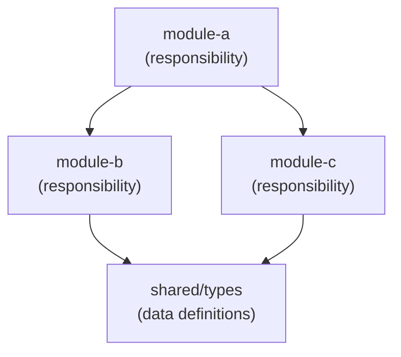
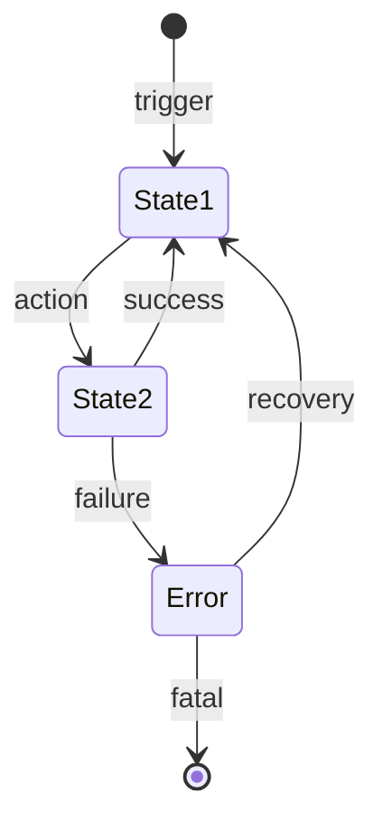
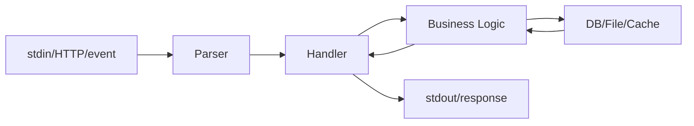

# Wireframe: System Structure Design

Design the high-level structure for: $ARGUMENTS

## Prerequisites

0. **Resolve recipe ID**: If `$ARGUMENTS` is empty, run `forge recipe status`
   to find the active recipe. Use its ID for all `{id}` references below.

1. Read research output:
   - `.forge/state/recipes/{id}/research/v1.md` (or latest)
   - `.forge/state/recipes/{id}/scope.md`
   - `.forge/state/project-map.md` (existing system structure)

## Step 1: Component Diagram

Identify the main modules/packages/files and their relationships.
Express as a mermaid flowchart:



Rules:
- Each node = one file or module with its primary responsibility
- Each edge = a dependency or data flow
- Include external dependencies (DB, API, filesystem) as distinct nodes
- Show the direction of dependency (who imports whom)

## Step 2: State Machine

Define ALL states the system can be in and ALL transitions between them.
This is the most critical diagram — it forces enumeration of every execution path.



Rules:
- **Every state must have at least one exit transition** (no dead ends)
- **Every state must be reachable** (no orphan states)
- **Error states must have recovery paths** unless explicitly terminal
- **Concurrent states** use parallel notation if applicable
- Include timeout transitions where relevant

## Step 3: Data Flow

Show how data moves through the system from input to output:



Rules:
- Show transformation at each step (what format changes)
- Include error response paths (not just happy path)
- Mark async vs sync flows

## Step 4: File Structure

List ALL files to create or modify with dependencies:

| File | Action | Depends On | Responsibility |
|------|--------|------------|----------------|
| `pkg/types.go` | create | — | Shared type definitions |
| `pkg/server.go` | create | types.go | Server lifecycle |
| `pkg/handler.go` | create | server.go, types.go | Request handling |
| `main.go` | modify | pkg/ | Entry point |

Rules:
- Order by dependency (roots first)
- Mark create vs modify
- This becomes the basis for task decomposition in /forge-implement

## Step 5: Execution Path Enumeration

**This is the key verification step.** List ALL execution paths from the state machine:

```markdown
### All Execution Paths

1. **Happy path**: [*] → State1 → State2 → State1 (loop)
   - Triggers: normal request
   - Expected: process and return result

2. **Error + recovery**: State2 → Error → State1
   - Triggers: processing failure
   - Expected: log error, clean up, return to ready state

3. **Fatal error**: State2 → Error → [*]
   - Triggers: unrecoverable failure
   - Expected: log, notify, graceful shutdown

4. **Timeout**: State2 → Error (after N seconds)
   - Triggers: no response within deadline
   - Expected: cancel operation, return timeout error

(continue until ALL paths are enumerated)
```

For each path, verify:
- Is the trigger defined?
- Is the expected behavior described?
- Are side effects (logging, cleanup, notifications) specified?

## Step 6: Save and Log

Save to `.forge/state/recipes/{id}/wireframe.md`

Log:
```bash
forge recipe log {id} --phase wireframe --action wireframe --output wireframe.md --result "N components, N states, N paths"
```

Register in manifest:
```bash
forge recipe log {id} --action wireframe --output wireframe.md --doc-type research --based-on scope.md
```

## Quality Gate

Before proceeding to draft, the wireframe must have:
- [ ] Component diagram with all modules and dependencies
- [ ] State machine with no dead-end states
- [ ] Data flow with error paths included
- [ ] File structure with dependency order
- [ ] ALL execution paths enumerated with triggers and expected behavior
- [ ] No orphan states (every state reachable)
- [ ] Every error state has a recovery or terminal path
